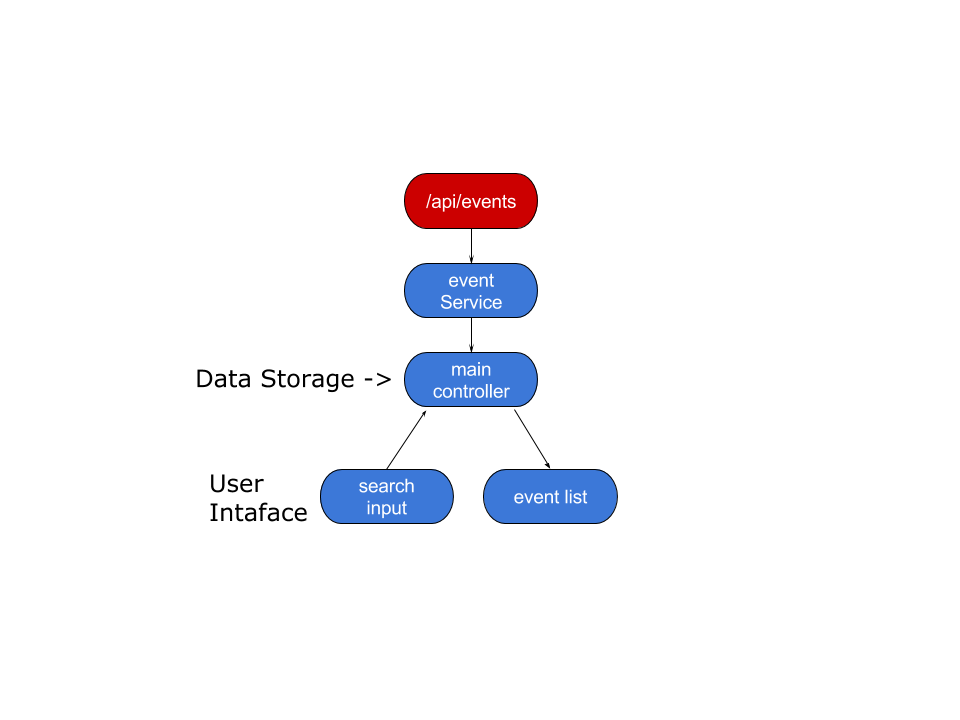

## 目次

### angular 編

 1. 簡単なAngularアプリケーションの作成
   1. 一覧を表示する
     1. apiの追加
     1. controllerの修正
 1. イベントid検索を行う
   1. factoryを用意する。
     1. 機能拡張 (getAll, searchの追加)
     1. $resourceを使う
   1. factoryを呼び出す。
   1. イベントID一致検索の実装
   1. 単体テスト(service側)
   1. 単体テストとモック(Controller側)
 1. 登録処理の追加
   1. factoryにsave機能を追加
   1. formバリデーション機能を追加

### component 編

 1. sherd service component
   1. templateのclone
   1. private-bowerの設定
   1. serviceの作成
   1. テスト
   1. build
 1. tag component
   1. templateのclone
   1. private-bowerの設定
   1. bower install
   1. directiveの作成
   1. テスト
   1. build
 1. 作成したページにコンポーネントの追加
   1. private-bowerの設定
   1. bower install
   1. コンポーネントの追加

### End to End Test 編

 1. protractorのインストールと更新
 1. page objectの実装
 1. テストケース実装
 1. テストの実行

## 環境構築

### 環境準備

#### nodeJSのインストール

 + [公式ページ参照](https://nodejs.org/)
 + [git](https://git-scm.com/download/win)のインストールが必要です。

#### javaのインストール

 + [公式ページ参照](https://www.java.com/ja/download/help/download_options.xml)

### angular fullstackのインストール

 + [公式ページ参照](https://github.com/DaftMonk/generator-angular-fullstack#usage)
 + Windowsの場合[python](https://www.python.org/downloads/)もインストールしてください。

## 簡単なAngularアプリケーションの作成

 + イベント一覧を表示、検索、フィルタできる。
 + [時間があれば]イベントの登録ができる。

### template モジュールの作成

```sh

# プロジェクトフォルダを作成
mkdir example
cd example

# テンプレートの展開
yo angular-fullstack example
```


```sh
# プロジェクトの実行、コレで画面が立ち上がる。
grunt serve
```

### 検索処理とAPI、画面の実装

#### apiの追加

サーバー側のAPI(モックAPI)を作成する。

[angular-fullstack](https://github.com/DaftMonk/generator-angular-fullstack#endpoint)専用のコマンドを利用して作成する。

```sh

# エンドポイントAPIの作成
yo angular-fullstack:endpoint event

```

 + 以下のようなファイルが生成される。

```sh
server/
└── api
    └── events
        ├── events.controller.js # <= 処理の本体
        ├── events.spec.js       # <= テストケースファイル
        └── index.js             # <= ルーティング処理


```

 + `events.controller.js`と`index.js`を編集する。
 + getだけでなく、後に使うpostも作成しておく。

##### `events.controller.js`

```javascript
'use strict';

var _ = require('lodash');
var checkFizzbazz = function(no){
  if (no % 3 === 0){
    return 'fizz';
  }else if(no % 5 === 0){
    return 'bazz';
  }else{
    return 'no';
  }
};
var data = [1,2,3,4,5,6,7,8,9,10,11,12,13,14,15,16,17,18,19,20]
  .map(function (no){
    return {
      no: no,
      name: 'event' + no,
      detail: 'the event no ' + no,
      tag : checkFizzbazz(no)
    };
  });

// 全検索
exports.index = function(req, res) {
  res.json({
    data:data
  });
};

// ID検索
exports.search = function(req, res) {
  console.log('search', req.params.eventId );
  res.json({
    data:data.filter(function(event){
      return parseInt(event.no) === parseInt(req.params.eventId);
    })
  });
};

// 登録
exports.create = function(req, res) {
  console.log('create', req.body );
  data.push((function(){
      var no = data.length+1;
      return {
        no: no,
        name: req.body.name,
        detail: req.body.detail,
        tag : checkFizzbazz(no)
      }
    })());
  res.send(200);
};
```

##### `index.js`

```javascript
'use strict';

var express = require('express');
var controller = require('./event.controller');

var router = express.Router();

router.get('/', controller.index);
router.get('/:eventId', controller.search);
router.post('/', controller.create);

module.exports = router;

```

 + 作成できていれば[http://localhost:9000/api/events](http://localhost:9000/api/events)にアクセスすると、JSONデータが表示される。

#### controllerの修正

 + 画面を修正して行く。

`client/app/main/main.controller.js`を修正する。

修正内容は`things`を`event`に変更

```javascript

angular.module('exampleApp')
  .controller('MainCtrl', function ($scope, $http) {
    $scope.events = [];

    $http.get('/api/events').success(function(event) {
      $scope.events = event.data;
    });

  });

```

あわせて画面のhtml`client/app/main/main.html`も修正する。

```html
<div ng-include="'components/navbar/navbar.html'"></div>

<div class="container">

  <div class="row">
    <div class="col-lg-12">
      <h1 class="page-header">Events:</h1>
      <ul class="nav nav-tabs nav-stacked col-md-4 col-lg-4 col-sm-6"
          ng-repeat="event in events">
        <li>
          <a>{{event.name}}</a>
          <em ng-bind="event.no"></em> : <small>{{event.detail}} to TAG:{{event.tag}}</small>
        </li>
      </ul>
    </div>
  </div>
</div>

<footer class="footer">
  <div class="container">
      <p>Angular Fullstack v2.1.1 |
        <a href="https://twitter.com/tyhenkel">@tyhenkel</a> |
         <a href="https://github.com/DaftMonk/generator-angular-fullstack/issues?state=open">Issues</a></p>
  </div>
</footer>
```

 + これで一覧が表示される。


## イベントid検索を行う

今回は検索処理を追加すると同時に、検索API呼び出しを別モジュールに分割します。

### factoryを作成する

```sh
yo angular-fullstack:factory event
```

以下のようなファイルが作成される。

```sh
client/app/event
├── event.service.js
└── event.service.spec.js
```

#### [$resource](https://docs.angularjs.org/api/ngResource)を使う

 + angular fullstackには既に`ngResource`が設定されている為、特殊な設定は不要。

`client/app/event/event.service.js`を以下のように編集する。

```javascript
(function(){
  'use strict';

  class EventService{
    constructor($resource){
      this.resource = $resource('/api/events/:eventId',{eventId: '@id'},{
        search: {method:'GET', params:{charge:true} },
      });
    }

    getAll(){
      return this.resource.search({}).$promise.then(req=> req.data);
    }

    search(id){
      return this.resource.search({eventId: id }).$promise.then(req=> req.data);
    }

    static eventFactory($resource){
      return new EventService($resource);
    }
  }

  EventService.eventFactory.$inject = ['$resource'];
  angular.module('exampleApp')
    .factory('app.component.events.service', EventService.eventFactory);
})();
```

#### 作成したFactoryの単体テストを行う。

 + `grunt test:client`で確認できる。
 + 通信系処理を`client/app/event/event.service.js`に移動したため、`client/app/main/main.controller.spec.js`のテストが落ちるのでコメントアウトしておく。
 + `client/app/event/event.service.spec.js`を以下のように編集する。
 + [karma-coverage(Istanbul)](https://github.com/karma-runner/karma-coverage)を導入してカバレッジ計測をしながら作って行く事推奨

```javascript
'use strict';

describe('Service: event', function () {

  beforeEach(module('exampleApp'));

  var event, $httpBackend;
  beforeEach(inject([
    'app.component.events.service',
    '$httpBackend',
    function (_event_, _$httpBackend_) {
      event = _event_;
      $httpBackend = _$httpBackend_;
    }]));

  it('should do something', function () {
    expect(!!event).toBe(true);
  });

  describe('get', ()=>{
    afterEach(()=> $httpBackend.verifyNoOutstandingExpectation());
    afterEach(()=> $httpBackend.verifyNoOutstandingRequest());
    beforeEach(()=> $httpBackend.resetExpectations());

    describe('getAll', ()=>{

      var requestJson = {
          "data":[
            {"no":1,"name":"event1","detail":"the event no 1","tag":"no"},
            {"no":2,"name":"event2","detail":"the event no 2","tag":"no"}
          ]};
      beforeEach(()=>{
        $httpBackend.expectGET(/.*\/api\/events.*/).respond(201, requestJson);
      });
      it('call', ()=>{
        var result;
        event.getAll().then(data=>{
          result=data;
        });
        $httpBackend.flush();
        expect(result).toEqual(requestJson.data);
      });
    });

    describe('search', ()=>{
      var requestJson = {
          "data":[
            {"no":1,"name":"event1","detail":"the event no 1","tag":"no"}
          ]};
      beforeEach(()=>{
        $httpBackend.expectGET(/.*\/api\/events\/1.*/).respond(201, requestJson);
      });
      it('call', ()=>{
        var result;
        event.search(1).then(data=>{
          result=data;
        });
        $httpBackend.flush();
        expect(result).toEqual(requestJson.data);
      });
    });
  });

});
```

#### factoryを呼び出す

テストが通ったモジュールを利用するため、`client/app/main/main.controller.js`を以下のように編集する。

```javascript
'use strict';

angular.module('exampleApp')
  .controller('MainCtrl', [
    '$scope',
    'app.component.events.service',
    function ($scope, eventService) {
      $scope.events = [];

      eventService.getAll()
        .then(data=> $scope.events = data);

    }]);
```

#### イベントID一致検索の実装

`client/app/main/main.html`に検索UIを実装。

```html
<!-- 省略 -->

  <h1 class="page-header">Events:</h1>
  <div class="form-group">
    <label class="control-label"> イベント検索(ID)</label>
    <input class="form-control" ng-model="eventfilter"/>
    <button class="btn btn-info" ng-click="search()">検索</button>
    <button class="btn btn-info" ng-click="allSearch()">全部取得</button>
  </div>
  <ul class="nav nav-tabs nav-stacked col-md-4 col-lg-4 col-sm-6"

<!-- 省略 -->
```

`client/app/main/main.controller.js`に処理を実装。

```javascript
'use strict';

angular.module('exampleApp')
  .controller('MainCtrl', [
    '$scope',
    'app.component.events.service',
    function ($scope, eventService) {
      $scope.events = [];

      $scope.search = ()=>{
        eventService.search($scope.eventfilter).then(data=>{
          $scope.events = data;
        });
      };

      $scope.allSearch = ()=>{
        eventService.getAll({}).then(data=>{
          $scope.events = data;
        });
      };
    }]);
```

#### 単体テストとモック(Controller側)

`client/app/main/main.controller.spec.js`へ単体テストを書く。

```javascript
'use strict';

describe('Controller: MainCtrl', function () {

  // load the controller's module
  beforeEach(module('example2App'));
  // 本来なら`event.mock.js`など作っておいて、使い回せるようにした方が良い。
  beforeEach(module(function($provide) {
    $provide.value('app.component.events.service',{
      getAll: jasmine.createSpy().andCallFake(() => {
        return {
          then:cb=> cb([{"no":1,"name":"event1","detail":"the event no 1","tag":"no"},
                        {"no":2,"name":"event2","detail":"the event no 2","tag":"no"}])
        };
      }),
      search: jasmine.createSpy().andCallFake(() => {
        return {
          then:cb=> cb([{"no":1,"name":"event1","detail":"the event no 1","tag":"no"}])
        }
      })
    });
  }));

  var MainCtrl,
      scope,
      eventService;

  // Initialize the controller and a mock scope
  beforeEach(inject([
    '$controller',
    '$rootScope',
    'app.component.events.service',
    function ($controller, $rootScope, _eventService_) {
      eventService = _eventService_;
      scope = $rootScope.$new();
      MainCtrl = $controller('MainCtrl', {
        $scope: scope
      });
    }]));

  it('getAll', function () {
    scope.allSearch();
    expect(scope.events.length).toBe(2);
    expect(eventService.getAll).toHaveBeenCalled();
    expect(eventService.getAll).toHaveBeenCalledWith({});
  });

  it('search', function () {
    scope.eventfilter = 10;
    scope.search(1);
    expect(scope.events.length).toBe(1);
    expect(eventService.search).toHaveBeenCalled();
    expect(eventService.search).toHaveBeenCalledWith(10);
  });
});

```

### 登録処理の追加 (時間があれば)

保存処理を`client/app/events/events.service.js`に追加する。

 + `$resource`の定義に`save: {method:'POST', params:{charge:true} }`を追加
 + 処理`save(name, detail)`メソッドを追加
 + `client/app/events/events.service.spec.js`に対応する単体テストを追加して見ましょう。

```javascript
(function(){
  'use strict';

  class EventService{
    constructor($resource){
      this.resource = $resource('/api/events/:eventId',{eventId: '@id'},{
        search: {method:'GET', params:{charge:true} },
        save: {method:'POST', params:{charge:true} },
      });
    }

    getAll(){
      return this.resource.search({}).$promise.then(req=> req.data);
    }

    search(id){
      return this.resource.search({eventId: id }).$promise.then(req=> req.data);
    }

    save(name, detail){
      return this.resource.save({
        name:name,
        detail:detail
      }).$promise;
    }

    static eventFactory($resource){
      return new EventService($resource);
    }
  }

  EventService.eventFactory.$inject = ['$resource'];
  angular.module('exampleApp')
    .factory('app.component.events.service', EventService.eventFactory);
})();

```

新しくpageを作成する。

```sh
yo angular-fullstack:route register
```

作成したページへのリンクを作成する。

`client/components/navbar/navbar.controller.js`へ以下を追記する。

`$scope.menu`の配列の値に`{'title': '登録画面', 'link': '/register'}`を追加する。

```javascript
    $scope.menu = [{
      'title': 'Home',
      'link': '/'
    },{
      'title': '登録画面',
      'link': '/register'
    }];

```

追加した`client/app/register/register.html`を編集する。

```html
<div ng-include="'components/navbar/navbar.html'"></div>

<form class="form-horizontal" novalidate ng-submit="register()" name="eventform">
  <div class="form-group">
    <label for="inputEmail3" class="col-sm-2 control-label">イベント名</label>
    <div class="col-sm-10">
      <input class="form-control" placeholder="入力例：）AngularHandsOn" name="name"
        ng-model="name" required>
      <span class="text-danger"ng-show="eventform.name.$error.required">必須です。</span>
    </div>
  </div>
  <div class="form-group">
    <label for="inputPassword3" class="col-sm-2 control-label">イベント詳細</label>
    <div class="col-sm-10">
      <input class="form-control" placeholder="入力例：）Angularの体験学習を行います。" name="detail"
        ng-model="detail" required>
      <span class="text-danger"ng-show="eventform.detail.$error.required">必須です。</span>
    </div>
  </div>
  <div class="form-group">
    <div class="col-sm-offset-2 col-sm-10">
      <button ng-disabled="eventform.$invalid" type="submit" class="btn btn-default">登録</button>
    </div>
  </div>
</form>

<footer class="footer">
  <div class="container">
      <p>Angular Fullstack v2.1.1 |
        <a href="https://twitter.com/tyhenkel">@tyhenkel</a> |
         <a href="https://github.com/DaftMonk/generator-angular-fullstack/issues?state=open">Issues</a></p>
  </div>
</footer>
```

対応するcontroller`client/app/register/register.controller.js`を編集する。

```javascript
'use strict';

angular.module('exampleApp')
  .controller('RegisterCtrl', [
    '$scope',
    'app.component.events.service',
    function ($scope, eventsService) {

      $scope.register = ()=>{
        console.log('register', eventsService);
        eventsService.save($scope.name, $scope.detail)
          .then(()=> alert('保存しました。'));
      };

    }]);
```

## コンポーネント編

#### ここ迄作成したアプリのイメージ

ここまでは単一アプリとして作成してきました。

`/api/eevnts`から取得したデータをcontrollerで保持し、画面に表示しています。



#### 今回作成するイメージ

今回は新たにデータを共有する共通コンポーネントと、その共通コンポーネントに依存した形の`tag UI`コンポーネントを作成します。


 + * `tag UI`は`Sheard Data (component)`に依存している。

### 初期設定

 + [angular用Component作成starter kit](https://github.com/MSakamaki/ng-component-template)
 + `clone`後、同フォルダで`npm install`を行う。

#### 開発

```sh
grunt
```

#### テスト

```sh
grunt test
```

#### ビルド

```sh
grunt build
```

#### private bower のインストールと実行

今回はローカルで実行。開発時にはどこかサーバーを用意する必要が有る。

[private bower template](https://github.com/MSakamaki/private-bower-template)を使い、private bower環境をローカルに構築する。

実行できれば[http://localhost:5678/](http://localhost:5678/)にアクセスする事でprivate bowerへアクセスできる。


### データを共通化するためのコンポーネントを作る

 + モジュール名は`app.component.events`で作成
 + [完成版](https://github.com/MSakamaki/sample-sheard-service)
 + コンポーネント間でのデータ共有方法は色々有るが、今回はSheard Serviceを作成する。

#### モジュール名の修正

リンクの通り、ファイルのモジュール名を修正する。

 + [config/ngtemplates.js](https://github.com/MSakamaki/sample-sheard-service/blob/master/config/ngtemplates.js)

#### モジュールファイル作成。

`src`フォルダの中身をすべて、一旦削除する。

以下のようにファイルを作成する。

```sh
src/
├── eventSheard.service.js
└── eventSheard.service.spec.js
```

 + [src/eventSheard.service.js](https://github.com/MSakamaki/sample-sheard-service/blob/master/src/eventSheard.service.js)
 + [src/eventSheard.service.spec.js](https://github.com/MSakamaki/sample-sheard-service/blob/master/src/eventSheard.service.spec.js)

デモページを以下リンクの内容のように編集する。

+ [demo/index.html](https://github.com/MSakamaki/sample-sheard-service/blob/master/demo/index.html)

`grunt`コマンドでデモ画面が表示されればOK

#### git へ登録

コンポーネントとして取り込めるようにする為に、gitリポジトリーへ登録する必要がある。

今回はpublicなgithubリポジトリを使用する。

Bitbucketやstash, github enterpriseでも利用可能。

 + リポジトリへ登録する前に`grunt build`を行いリリースモジュールを作成する。
 + リポジトリの登録とpushは割愛

#### private bower への登録

`.bowerrc`にある`"registry": "http://localhost:5678"`がprivate bowerを有効かさせる為の設定

向き先がprivate bowerになっている状態で以下のコマンドを実行する事で登録される。

```sh
bower register [パッケージ名] [対象リポジトリ]
```

登録されたかの確認は[privateBowerのページ(http://localhost:5678)](http://localhost:5678)で確認できる。

privateなので[globalのbower](http://bower.io/search/?q=sample-sheard-service)には登録されていない事も確認できる


### tag ui componentを作る

 + モジュール名は`app.component.events.directive`で作成
 + [完成版](https://github.com/MSakamaki/my-event-tags)
 + 先ほど作ったデータ共有コンポーネントを使う。

### コンポーネントを使う。

データ共有コンポーネントを使う為に、以下のコマンドを実行する。

```sh
bower install -save [データ共有コンポーネントのパッケージ名]
```

#### モジュール名の修正

[config/ngtemplates.js](https://github.com/MSakamaki/my-event-tags/blob/master/config/ngtemplates.js)をリンクの通り修正する。

#### モジュールファイル作成。

`src`フォルダの中身をすべて、一旦削除し、以下のようにファイルを作成する。
(ファイルのリネームでもOK)

```sh
src
├── tag.directive.css
├── tag.directive.html
├── tag.directive.js
└── tag.directive.spec.js
```

それぞれ編集する。

 + [src/tag.directive.css](https://github.com/MSakamaki/my-event-tags/blob/master/src/tag.directive.css)
 + [src/tag.directive.html](https://github.com/MSakamaki/my-event-tags/blob/master/src/tag.directive.html)
 + [src/tag.directive.js](https://github.com/MSakamaki/my-event-tags/blob/master/src/tag.directive.js)
 + [src/tag.directive.spec.js](https://github.com/MSakamaki/my-event-tags/blob/master/src/tag.directive.spec.js)


#### デモページの実行

デモ実行する為に、`index.html`を編集する。

 + [demo/index.html](https://github.com/MSakamaki/my-event-tags/blob/master/demo/index.html)
 + データ共有コンポーネントを読み込む`<script src="sample-sheard-service/bin/index.js"></script>`部分は適宜書き換えてください。


`grunt`コマンドでデモ画面が表示されればOK

以降、データ共有コンポーネントと同じようにprivate githubへの登録を行う。

### exampleアプリケーションで作成したコンポーネントを使う。

#### `.bowerrc`の設定を追加する。

```json
{
    "registry": "http://localhost:5678",
    "directory": "client/bower_components"
}
```

#### `bower install`を行う。

```sh
bower install -save [tagUIパッケージ名] [データ共有パッケージ名]
```

モジュールを読み込む為に`app.js`を編集する。

 + `'app.component.events'`と`'app.component.events.directive'`を追加する。

```javascript
'use strict';

angular.module('exampleApp', [
  'ngCookies',
  'ngResource',
  'ngSanitize',
  'ui.router',
  'ui.bootstrap',
  'app.component.events',
  'app.component.events.directive'
])
  .config(function ($stateProvider, $urlRouterProvider, $locationProvider) {
    $urlRouterProvider
      .otherwise('/');

    $locationProvider.html5Mode(true);
  });

```

`client/app/main/main.html`の任意の箇所(検索ボックスの下あたり)に`<event-tags></event-tags>`を追記する。

ここまで実行できていれば、`grunt serve`を実行すとcomponentが画面上に描画される。


#### サービスの連携

componentの操作をする為の`app.component.events.sheard.service`処理を追加する。

 + コメントアウトが修正前

```javascript
'use strict';

angular.module('exampleApp')
  .controller('MainCtrl', [
    '$scope',
    'app.component.events.service',
    'app.component.events.sheard.service',
    function($scope, eventService, eventData) {
      $scope.eventData = eventData;

      $scope.search = ()=>{
        eventService.search($scope.eventfilter).then(data=>{
          eventData.event.create(data);
        });
      };

      $scope.allSearch = ()=>{
        eventService.getAll({}).then(data=>{
          eventData.event.create(data);
        });
      };
    }]);
```

#### `client/app/main/main.html`を修正する

 + `ng-repeat="event in events"`を`ng-repeat="event in eventData.event.get() | filter:eventData.tag.filter()"`に変更する。


##### おまけ

AngularのFilter機能を体験してもらう為にこのような形にしましたが、
本来であれば`ng-repeat="event in eventData.event.get() | filter:eventData.tag.filter()"`にしなくても、
`app.component.events.sheard.service`に`eventData.event.getFilter()`等を作成してフィルタした物が取得できるようにした方がより良い作りです。

## End to End Testing

`angular-fullstack`にもprotractorはインストールされているが、深く理解するためゼロベースで構築＆実行する。

[Page Object パターン](https://code.google.com/p/selenium/wiki/PageObjects)で作成して行きます。


### protractorのインストールと実行

[generator-protractor](https://www.npmjs.com/package/generator-protractor)を使用する。

 + コマンド

```sh
# selenium webdriverの更新
node_modules/grunt-protractor-runner/node_modules/protractor/bin/webdriver-manager update

# e2eテストの実行
grunt test:e2e
```

現時点で実行するとテストは落ちるが、それは大幅な改修を加えたためです。

今回の修正に合わせてe2eテストを修正し、動作するようにしましょう。

```sh
e2e/
└── main
    ├── main.po.js    # <- ページオブジェクト
    └── main.spec.js  # <- テストシナリオ
```


#### page objectの実装

`e2e/main/main.po.js`の実装

 + protractorのAPIは[APIドキュメント](https://angular.github.io/protractor/#/api)参照

##### テストの大きな流れとしては


 1. PageObject作成
   + element(画面項目）の実装
   + verification(表示確認)の実装
   + service(画面の振る舞い)の実装
 1. テストケースの実装
   + シナリオを書く
   + テスト処理の実装
 1. テストの実行

```sh
/**
 * This file uses the Page Object pattern to define the main page for tests
 * https://docs.google.com/presentation/d/1B6manhG0zEXkC-H-tPo2vwU06JhL8w9-XCF9oehXzAQ
 */

'use strict';

var MainPage = function() {
  /** elementの実装 */
  this.inputEventfilter = element(by.model('eventfilter'));
  this.btnSearch = element(by.css('button[ng-click="search()"]'));
  this.listEvents = element.all(by.repeater('event in eventData.event.get() | filter:eventData.tag.filter()'));

  /** page verificationの実装 */
  this.verification = function(){
    var _elm = this;
    return Promise.all([
        (function(){ return browser.wait(function() {return _elm.inputEventfilter.isPresent(); }, 10000); })(),
        (function(){ return browser.wait(function() {return _elm.btnSearch.isPresent(); }, 10000); })()
      ]);
  }

  /** serviceの実装 */
  this.eventSearch = function(eventNo){
    var mainPage  = new MainPage();
    return browser.wait(function(){
      return mainPage.inputEventfilter.isPresent();
    }).then(function(){
      mainPage.inputEventfilter.sendKeys(eventNo);
      return mainPage.btnSearch.click();
    });
  }
};

module.exports = new MainPage();

```

#### テストケース実装

`e2e/main/main.spec.js`の実装

```javascript
'use strict';

describe('Main View', function() {
  var page;

  beforeEach(function() {
    /* ルートページにアクセス(URLはprotractor.conf.jsのbaseUrlに設定されている) */
    browser.get('/');

    /* page objectをimport */
    page = require('./main.po');
  });

  it('10を設定してフィルタ検索すると、最初の１行目にevent10が表示される', function(done) {

    /** Page Verification によりそのPage Objectが正しく表示されている事を確認する */
    page.verification().then(function(){

      /** service eventSearch()を使って、10で検索を行う */
      return page.eventSearch(10);
    }).then(function(){

      /** 検索結果elementの１行目のテキスト文字が'10'である事を確認する */
      return expect(page.listEvents.get(0).getText()).toBe('10');
    }).then(function(){

      /** テストが完了した事をjasmine(テストフレームワーク)に通知 */
      return done();
    });
  });
});

```

#### テストを実行する

以下のコマンドでe2eテストの実行が可能できます、実行してみましょう。


```sh
grunt test:e2e
```


テストが失敗すると思います。

これは`expect(page.listEvents.get(0).getText()).toBe('10');`の条件、`.toBe('10')`が間違っているからです。

テストを正常に完了させる為に、`expect`を以下のように修正しましょう。


```javascript
expect(page.listEvents.get(0).getText())
  .toBe('event10\n10 : the event no 10 to TAG:bazz');
```


テストを`grunt test:e2e`で実行し、正常に完了すれば完了です。

#### *[おまけ]* 以下のようなテストケースを書いてみましょう。

 1. 全検索を行って、tagでフィルタする
 1. イベントの新規登録(作成していれば)


